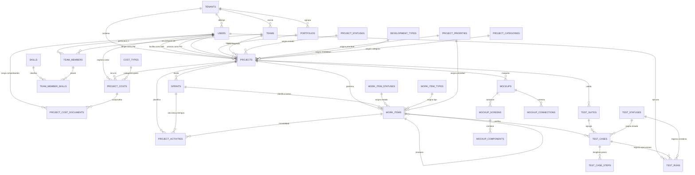

# Esquema de Base de Datos, Diccionario de Datos y Diagrama ER
## Sistema de Gestión de Proyectos de Ingeniería y Auditoría de Calidad (Multi-Tenant) - Versión Alta Normalización (Power BI Ready)

Este documento describe de forma exhaustiva el diseño relacional optimizado para producción de la base de datos (PostgreSQL), incluyendo el diccionario de datos detallado, el modelo Entidad-Relación (ER), las vistas de modelo de estrella preparadas para Power BI, y las soluciones completas a observaciones de normalización estricta.

---

## 1. Diagrama Entidad-Relación (ER)

El siguiente diagrama muestra el modelo totalmente normalizado, eliminando atributos multivaluados y separando las dimensiones del sistema en catálogos específicos para facilitar la analítica de negocio.



---

## 2. Solución de Hallazgos y Refinamiento de Normalización (Formas Normales Estrictas)

Para cumplir estrictamente con **1FN, 2FN y 3FN**, y preparar la base de datos para integrarse nativamente con almacenes de datos y herramientas de BI como **Power BI**, se han implementado las siguientes optimizaciones de arquitectura:

### 2.1. Normalización de Atributos Multivaluados (1FN Estricta)
* **Antes:** `team_members.skills TEXT[]` y `test_cases.steps TEXT[]` rompían la atomicidad de las columnas. Realizar filtros por habilidades específicas o contar pasos fallidos requería transformaciones de arreglos complejas en Power BI.
* **Solución:**
  * Se creó la tabla catálogo `skills` para centralizar las tecnologías.
  * Se creó la tabla de relación `team_member_skills` para asociar usuarios y habilidades de forma atómica a través de `team_member_id`.
  * Se creó la tabla subordinada `test_case_steps` para desglosar de forma secuencial cada paso con su `step_number` e `instruction`, permitiendo un modelo estrella limpio y mediciones de granularidad fina en QA.

### 2.2. Sustitución de Restricciones CHECK por Tablas de Catálogo (Dimensiones Inteligentes)
* **Antes:** Los estados de proyectos, prioridades, tipos de tareas, tipos de costos y categorías de proyectos estaban definidos mediante constraints `CHECK` o texto libre. En Power BI esto limita la creación de un modelo estrella con tablas de dimensiones bien estructuradas.
* **Solución:** Se crearon las siguientes tablas de catálogo:
  * `project_statuses` (Catálogo de estados de ciclo de vida).
  * `project_priorities` (Catálogo de prioridades corporativas).
  * `development_types` (Catálogo de modalidades de desarrollo: Interno, Mixto, Externo, etc.).
  * `project_categories` (Catálogo de categorías de envergadura del proyecto).
  * `work_item_statuses` (Catálogo de estados del Backlog Kanban).
  * `work_item_types` (Catálogo de tipos de ítems: Historia de Usuario, Tarea, Bug).
  * `cost_types` (Catálogo de naturalezas de costos de infraestructura, nómina, licencias, etc.).
  * `test_statuses` (Catálogo de veredictos: PASSED, FAILED, PENDING).

### 2.3. Segregación de Facturas y Evidencias Digitales (3FN Estricta)
* **Antes:** `project_costs` almacenaba directamente metadatos físicos de archivos (`storage_key`, `storage_url`, `file_name`, `file_size`, `uploaded_at`), mezclando datos financieros de costos con metadatos del sistema de archivos de almacenamiento en la nube (GCS/S3).
* **Solución:** Se aisló la información de archivos digitales en la tabla `project_cost_documents` ligada a `project_costs` vía `cost_id`, manteniendo `project_costs` como un registro financiero puro en tercera forma normal, enlazable opcionalmente a un documento mediante una llave foránea de relación uno a muchos.

### 2.4. Multi-Tenant Consistente y Exhaustivo
* **Antes:** Las tablas como `teams` y `portfolios` carecían de `tenant_id`, lo que impedía que una organización creara equipos de trabajo o portafolios de inversión privados e invisibles para otras cuentas de inquilinos.
* **Solución:** Se incluyó consistentemente la columna `tenant_id` en `teams` y `portfolios`, asegurando el aislamiento completo de los activos en todo el ciclo de vida operativa y estratégica de la plataforma.

### 2.5. Consistencia de Auditoría y Trazabilidad Incremental
* **Antes:** Solo algunas tablas poseían las marcas temporales `created_at` y `updated_at`, obstaculizando los esquemas de **actualización incremental** de datos en Power BI.
* **Solución:** Se agregaron sistemáticamente los campos de control de auditoría a todas las entidades transaccionales clave (`projects`, `sprints`, `work_items`, `project_costs`, `test_cases`, `test_runs`):
  * `created_at TIMESTAMPTZ` / `updated_at TIMESTAMPTZ`
  * `created_by_id VARCHAR(50)` / `updated_by_id VARCHAR(50)`
  * `active BOOLEAN`

---

## 3. Diccionario de Datos del Esquema Optimizado

### 3.1. Tabla Catálogo: `project_statuses`
| Columna | Tipo de Datos | Nulidad | Llave | Descripción |
| :--- | :--- | :---: | :---: | :--- |
| `id` | `VARCHAR(30)` | `NOT NULL` | **PK** | Código único del estado (ej. 'DESARROLLO', 'PRUEBAS'). |
| `name` | `VARCHAR(60)` | `NOT NULL` | | Nombre legible para pantallas y tableros. |
| `description` | `TEXT` | `NULL` | | Explicación del estado en el ciclo del proyecto. |

### 3.2. Tabla Catálogo: `project_priorities`
| Columna | Tipo de Datos | Nulidad | Llave | Descripción |
| :--- | :--- | :---: | :---: | :--- |
| `id` | `VARCHAR(20)` | `NOT NULL` | **PK** | Código único (ej. 'HIGH', 'MEDIUM', 'LOW'). |
| `name` | `VARCHAR(40)` | `NOT NULL` | | Nombre legible (ej. 'Alta', 'Media', 'Baja'). |

### 3.3. Tabla Transaccional: `projects`
| Columna | Tipo de Datos | Nulidad | Llave | Descripción |
| :--- | :--- | :---: | :---: | :--- |
| `id` | `VARCHAR(50)` | `NOT NULL` | **PK** | Identificador único del proyecto. |
| `tenant_id` | `VARCHAR(50)` | `NOT NULL` | **FK** | Referencia a `tenants.id` para aislamiento multi-tenant. |
| `portfolio_id` | `VARCHAR(50)` | `NULL` | **FK** | Referencia a `portfolios.id`. |
| `team_id` | `VARCHAR(50)` | `NULL` | **FK** | Referencia a `teams.id`. |
| `name` | `VARCHAR(150)` | `NOT NULL` | | Nombre comercial del proyecto de ingeniería. |
| `code` | `VARCHAR(30)` | `NOT NULL` | **UK** | Código abreviado único (ej. 'APP-CAMP'). |
| `description` | `TEXT` | `NULL` | | Memoria conceptual descriptiva. |
| `client` | `VARCHAR(100)` | `NULL` | | Empresa beneficiaria. |
| `sponsor` | `VARCHAR(50)` | `NULL` | **FK** | ID de usuario patrocinador directivo. |
| `project_manager_id`| `VARCHAR(50)`| `NULL` | **FK** | ID del Project Manager a cargo. |
| `scrum_master_id`| `VARCHAR(50)` | `NULL` | **FK** | ID del Scrum Master asignado. |
| `product_owner_id`| `VARCHAR(50)` | `NULL` | **FK** | ID del Product Owner responsable. |
| `status_id` | `VARCHAR(30)` | `NOT NULL` | **FK** | ID de estado (Referencia a `project_statuses.id`). |
| `priority_id` | `VARCHAR(20)` | `NOT NULL` | **FK** | ID de prioridad (Referencia a `project_priorities.id`). |
| `dev_type_id` | `VARCHAR(30)` | `NOT NULL` | **FK** | Referencia a `development_types.id`. |
| `category_id` | `VARCHAR(30)` | `NOT NULL` | **FK** | Referencia a `project_categories.id`. |
| `sprint_size_weeks`| `INTEGER` | `NOT NULL` | | Duración del Sprint en semanas (def: 2). |
| `start_date` | `DATE` | `NULL` | | Fecha de inicio. |
| `end_date` | `DATE` | `NULL` | | Fecha de fin. |
| `budget_total` | `NUMERIC(14,2)`| `NOT NULL` | | Presupuesto total asignado. |
| `created_at` | `TIMESTAMPTZ` | `NOT NULL` | | Auditoría: fecha de alta. |
| `updated_at` | `TIMESTAMPTZ` | `NOT NULL` | | Auditoría: fecha de última edición. |
| `created_by_id` | `VARCHAR(50)` | `NULL` | **FK** | ID de usuario que registró. |
| `updated_by_id` | `VARCHAR(50)` | `NULL` | **FK** | ID de usuario que modificó. |
| `active` | `BOOLEAN` | `NOT NULL` | | Indica si el registro está activo para cargas incrementales. |

### 3.4. Tabla Transaccional: `team_member_skills` (1FN Estricta)
| Columna | Tipo de Datos | Nulidad | Llave | Descripción |
| :--- | :--- | :---: | :---: | :--- |
| `team_member_id` | `VARCHAR(50)` | `NOT NULL` | **PK, FK** | ID de la relación de equipo (Referencia a `team_members.id`). |
| `skill_id` | `VARCHAR(50)` | `NOT NULL` | **PK, FK** | ID de la habilidad atómica (Referencia a `skills.id`). |

### 3.5. Tabla Transaccional: `test_case_steps` (1FN Estricta)
| Columna | Tipo de Datos | Nulidad | Llave | Descripción |
| :--- | :--- | :---: | :---: | :--- |
| `id` | `VARCHAR(50)` | `NOT NULL` | **PK** | Identificador de la secuencia de paso. |
| `test_case_id` | `VARCHAR(50)` | `NOT NULL` | **FK** | Caso de prueba relacionado (Referencia a `test_cases.id`). |
| `step_number` | `INTEGER` | `NOT NULL` | | Número de secuencia ordinal (1, 2, 3, etc.). |
| `instruction` | `TEXT` | `NOT NULL` | | Detalle de la acción a ejecutar. |
| `expected_behavior`| `TEXT` | `NULL` | | Comportamiento esperado de la UI/API ante este paso. |

---

## 4. Sentencias DDL PostgreSQL Completas (Esquema de Producción)

A continuación, se presenta el código SQL de creación física de tablas para desplegar el esquema de base de datos relacional y multi-tenant 100% normalizado.

```sql
-- -----------------------------------------------------------------
-- ESQUEMA COMPLETO ALTAMENTE NORMALIZADO POSTGRESQL (POWER BI READY)
-- SISTEMA MULTI-TENANT DE PROYECTOS Y AUDITORÍA DE CALIDAD
-- -----------------------------------------------------------------

-- 1. ESTRUCTURA BASE MULTI-TENANT
CREATE TABLE tenants (
  id varchar(50) PRIMARY KEY,
  name varchar(100) NOT NULL,
  subdomain varchar(50) UNIQUE,
  active boolean NOT NULL DEFAULT true,
  created_at timestamptz NOT NULL DEFAULT now(),
  updated_at timestamptz NOT NULL DEFAULT now()
);

-- 2. TABLAS DE CATÁLOGOS / DIMENSIONES (Evitan CHECK constraints y facilitan Power BI)
CREATE TABLE project_statuses (
  id varchar(30) PRIMARY KEY,
  name varchar(60) NOT NULL,
  description text
);

CREATE TABLE project_priorities (
  id varchar(20) PRIMARY KEY,
  name varchar(40) NOT NULL
);

CREATE TABLE work_item_types (
  id varchar(20) PRIMARY KEY,
  name varchar(40) NOT NULL
);

CREATE TABLE work_item_statuses (
  id varchar(30) PRIMARY KEY,
  name varchar(60) NOT NULL
);

CREATE TABLE cost_types (
  id varchar(30) PRIMARY KEY,
  name varchar(60) NOT NULL
);

CREATE TABLE development_types (
  id varchar(30) PRIMARY KEY,
  name varchar(60) NOT NULL
);

CREATE TABLE project_categories (
  id varchar(30) PRIMARY KEY,
  name varchar(60) NOT NULL
);

CREATE TABLE test_statuses (
  id varchar(20) PRIMARY KEY,
  name varchar(40) NOT NULL
);

CREATE TABLE skills (
  id varchar(50) PRIMARY KEY,
  name varchar(100) NOT NULL,
  category varchar(50)
);

-- 3. TABLAS ESTRUCTURALES DE PORTAFOLIOS Y EQUIPOS (Multi-Tenant)
CREATE TABLE portfolios (
  id varchar(50) PRIMARY KEY,
  tenant_id varchar(50) NOT NULL REFERENCES tenants(id) ON DELETE CASCADE,
  name varchar(150) NOT NULL,
  description text,
  active boolean NOT NULL DEFAULT true,
  created_at timestamptz NOT NULL DEFAULT now(),
  updated_at timestamptz NOT NULL DEFAULT now()
);

CREATE TABLE teams (
  id varchar(50) PRIMARY KEY,
  tenant_id varchar(50) NOT NULL REFERENCES tenants(id) ON DELETE CASCADE,
  name varchar(100) NOT NULL,
  description text,
  active boolean NOT NULL DEFAULT true,
  created_at timestamptz NOT NULL DEFAULT now(),
  updated_at timestamptz NOT NULL DEFAULT now()
);

-- 4. USUARIOS Y CONTROL DE ACCESO
CREATE TABLE users (
  id varchar(50) PRIMARY KEY,
  tenant_id varchar(50) NOT NULL REFERENCES tenants(id) ON DELETE CASCADE,
  first_name varchar(100) NOT NULL,
  last_name varchar(100) NOT NULL,
  email varchar(150) NOT NULL UNIQUE,
  password_hash varchar(255),
  status varchar(20) NOT NULL DEFAULT 'ACTIVE',
  created_at timestamptz NOT NULL DEFAULT now(),
  updated_at timestamptz NOT NULL DEFAULT now()
);

-- 5. RELACIONES DE PERSONAL NORMALIZADAS (1FN)
CREATE TABLE team_members (
  id varchar(50) PRIMARY KEY,
  team_id varchar(50) NOT NULL REFERENCES teams(id) ON DELETE CASCADE,
  user_id varchar(50) NOT NULL REFERENCES users(id) ON DELETE CASCADE,
  role varchar(100) NOT NULL,
  active boolean NOT NULL DEFAULT true,
  created_at timestamptz NOT NULL DEFAULT now(),
  updated_at timestamptz NOT NULL DEFAULT now(),
  UNIQUE(team_id, user_id)
);

CREATE TABLE team_member_skills (
  team_member_id varchar(50) NOT NULL REFERENCES team_members(id) ON DELETE CASCADE,
  skill_id varchar(50) NOT NULL REFERENCES skills(id) ON DELETE CASCADE,
  PRIMARY KEY (team_member_id, skill_id)
);

-- 6. PROYECTOS (Totalmente Normalizado, Multi-Tenant)
CREATE TABLE projects (
  id varchar(50) PRIMARY KEY,
  tenant_id varchar(50) NOT NULL REFERENCES tenants(id) ON DELETE CASCADE,
  portfolio_id varchar(50) REFERENCES portfolios(id) ON DELETE SET NULL,
  team_id varchar(50) REFERENCES teams(id) ON DELETE SET NULL,
  name varchar(150) NOT NULL,
  code varchar(30) NOT NULL,
  description text,
  client varchar(100),
  sponsor varchar(50) REFERENCES users(id) ON DELETE SET NULL,
  project_manager_id varchar(50) REFERENCES users(id) ON DELETE SET NULL,
  scrum_master_id varchar(50) REFERENCES users(id) ON DELETE SET NULL,
  product_owner_id varchar(50) REFERENCES users(id) ON DELETE SET NULL,
  status_id varchar(30) NOT NULL REFERENCES project_statuses(id),
  priority_id varchar(20) NOT NULL REFERENCES project_priorities(id),
  dev_type_id varchar(30) NOT NULL REFERENCES development_types(id),
  category_id varchar(30) NOT NULL REFERENCES project_categories(id),
  sprint_size_weeks integer NOT NULL DEFAULT 2,
  start_date date,
  end_date date,
  budget_total numeric(14,2) NOT NULL DEFAULT 0.00 CHECK (budget_total >= 0),
  created_at timestamptz NOT NULL DEFAULT now(),
  updated_at timestamptz NOT NULL DEFAULT now(),
  created_by_id varchar(50) REFERENCES users(id),
  updated_by_id varchar(50) REFERENCES users(id),
  active boolean NOT NULL DEFAULT true,
  UNIQUE(tenant_id, code)
);

-- 7. COSTOS DE PROYECTO Y DOCUMENTACIÓN SEGREGADA (3FN Estricta)
CREATE TABLE project_costs (
  id varchar(50) PRIMARY KEY,
  project_id varchar(50) NOT NULL REFERENCES projects(id) ON DELETE CASCADE,
  cost_type_id varchar(30) NOT NULL REFERENCES cost_types(id),
  description text,
  amount numeric(14,2) NOT NULL CHECK (amount >= 0),
  currency varchar(10) NOT NULL DEFAULT 'USD',
  created_at timestamptz NOT NULL DEFAULT now(),
  updated_at timestamptz NOT NULL DEFAULT now(),
  created_by_id varchar(50) REFERENCES users(id),
  updated_by_id varchar(50) REFERENCES users(id),
  active boolean NOT NULL DEFAULT true
);

CREATE TABLE project_cost_documents (
  id varchar(50) PRIMARY KEY,
  cost_id varchar(50) NOT NULL REFERENCES project_costs(id) ON DELETE CASCADE,
  storage_key varchar(255) NOT NULL,
  storage_url text NOT NULL,
  file_name varchar(255) NOT NULL,
  file_size integer NOT NULL CHECK (file_size > 0),
  uploaded_at timestamptz NOT NULL DEFAULT now(),
  uploaded_by_id varchar(50) REFERENCES users(id)
);

-- 8. GESTIÓN ÁGIL (SPRINTS Y REQUERIMIENTOS KANBAN)
CREATE TABLE sprints (
  id varchar(50) PRIMARY KEY,
  project_id varchar(50) NOT NULL REFERENCES projects(id) ON DELETE CASCADE,
  name varchar(100) NOT NULL,
  start_date date NOT NULL,
  end_date date NOT NULL,
  status varchar(20) NOT NULL DEFAULT 'PLANNING',
  created_at timestamptz NOT NULL DEFAULT now(),
  updated_at timestamptz NOT NULL DEFAULT now(),
  active boolean NOT NULL DEFAULT true
);

CREATE TABLE work_items (
  id varchar(50) PRIMARY KEY,
  project_id varchar(50) NOT NULL REFERENCES projects(id) ON DELETE CASCADE,
  sprint_id varchar(50) REFERENCES sprints(id) ON DELETE SET NULL,
  parent_id varchar(50) REFERENCES work_items(id) ON DELETE SET NULL,
  title varchar(150) NOT NULL,
  description text,
  type_id varchar(20) NOT NULL REFERENCES work_item_types(id),
  status_id varchar(30) NOT NULL REFERENCES work_item_statuses(id),
  priority_id varchar(20) NOT NULL REFERENCES project_priorities(id),
  story_points integer CHECK (story_points >= 0),
  assignee_id varchar(50) REFERENCES users(id) ON DELETE SET NULL,
  created_at timestamptz NOT NULL DEFAULT now(),
  updated_at timestamptz NOT NULL DEFAULT now(),
  created_by_id varchar(50) REFERENCES users(id),
  updated_by_id varchar(50) REFERENCES users(id),
  active boolean NOT NULL DEFAULT true
);

-- 9. CRONOGRAMA Y GANTT (ACTIVIDADES DE PROYECTO)
CREATE TABLE project_activities (
  id varchar(50) PRIMARY KEY,
  project_id varchar(50) NOT NULL REFERENCES projects(id) ON DELETE CASCADE,
  sprint_id varchar(50) REFERENCES sprints(id) ON DELETE SET NULL,
  name varchar(150) NOT NULL,
  description text,
  start_date date NOT NULL,
  end_date date NOT NULL,
  progress integer NOT NULL DEFAULT 0 CHECK (progress >= 0 AND progress <= 100),
  work_item_id varchar(50) REFERENCES work_items(id) ON DELETE SET NULL,
  created_at timestamptz NOT NULL DEFAULT now(),
  updated_at timestamptz NOT NULL DEFAULT now(),
  active boolean NOT NULL DEFAULT true
);

CREATE TABLE project_activity_dependencies (
  activity_id varchar(50) NOT NULL REFERENCES project_activities(id) ON DELETE CASCADE,
  predecessor_id varchar(50) NOT NULL REFERENCES project_activities(id) ON DELETE CASCADE,
  PRIMARY KEY (activity_id, predecessor_id)
);

-- 10. GESTIÓN DE CALIDAD Y QA (1FN Estricta)
CREATE TABLE test_suites (
  id varchar(50) PRIMARY KEY,
  project_id varchar(50) NOT NULL REFERENCES projects(id) ON DELETE CASCADE,
  title varchar(150) NOT NULL,
  description text,
  created_at timestamptz NOT NULL DEFAULT now(),
  updated_at timestamptz NOT NULL DEFAULT now(),
  active boolean NOT NULL DEFAULT true
);

CREATE TABLE test_cases (
  id varchar(50) PRIMARY KEY,
  suite_id varchar(50) NOT NULL REFERENCES test_suites(id) ON DELETE CASCADE,
  work_item_id varchar(50) REFERENCES work_items(id) ON DELETE SET NULL,
  title varchar(150) NOT NULL,
  expected_result text NOT NULL,
  status_id varchar(20) NOT NULL REFERENCES test_statuses(id),
  created_at timestamptz NOT NULL DEFAULT now(),
  updated_at timestamptz NOT NULL DEFAULT now(),
  active boolean NOT NULL DEFAULT true
);

CREATE TABLE test_case_steps (
  id varchar(50) PRIMARY KEY,
  test_case_id varchar(50) NOT NULL REFERENCES test_cases(id) ON DELETE CASCADE,
  step_number integer NOT NULL CHECK (step_number > 0),
  instruction text NOT NULL,
  expected_behavior text,
  UNIQUE(test_case_id, step_number)
);

CREATE TABLE test_runs (
  id varchar(50) PRIMARY KEY,
  test_case_id varchar(50) NOT NULL REFERENCES test_cases(id) ON DELETE CASCADE,
  tester_id varchar(50) NOT NULL REFERENCES users(id),
  run_date timestamptz NOT NULL DEFAULT now(),
  status_id varchar(20) NOT NULL REFERENCES test_statuses(id),
  actual_result text,
  comments text
);

-- 11. MAQUETACIÓN VISUAL (MOCKUPS DE FRONTEND)
CREATE TABLE mockups (
  id varchar(50) PRIMARY KEY,
  project_id varchar(50) NOT NULL REFERENCES projects(id) ON DELETE CASCADE,
  name varchar(100) NOT NULL,
  description text,
  created_at timestamptz NOT NULL DEFAULT now(),
  updated_at timestamptz NOT NULL DEFAULT now(),
  active boolean NOT NULL DEFAULT true
);

CREATE TABLE mockup_screens (
  id varchar(50) PRIMARY KEY,
  mockup_id varchar(50) NOT NULL REFERENCES mockups(id) ON DELETE CASCADE,
  title varchar(100) NOT NULL,
  description text,
  x_position integer NOT NULL DEFAULT 100,
  y_position integer NOT NULL DEFAULT 100,
  width integer NOT NULL DEFAULT 375,
  height integer NOT NULL DEFAULT 812
);

CREATE TABLE mockup_components (
  id varchar(50) PRIMARY KEY,
  screen_id varchar(50) NOT NULL REFERENCES mockup_screens(id) ON DELETE CASCADE,
  mockup_id varchar(50) NOT NULL REFERENCES mockups(id) ON DELETE CASCADE,
  type varchar(50) NOT NULL,
  label varchar(100) NOT NULL,
  x_position integer NOT NULL,
  y_position integer NOT NULL,
  width integer NOT NULL,
  height integer NOT NULL,
  properties jsonb
);

CREATE TABLE mockup_connections (
  id varchar(50) PRIMARY KEY,
  mockup_id varchar(50) NOT NULL REFERENCES mockups(id) ON DELETE CASCADE,
  source_screen_id varchar(50) NOT NULL REFERENCES mockup_screens(id) ON DELETE CASCADE,
  target_screen_id varchar(50) NOT NULL REFERENCES mockup_screens(id) ON DELETE CASCADE,
  trigger_element_id varchar(50),
  connection_type varchar(50) NOT NULL DEFAULT 'NAVIGATE'
);

-- 12. VISTAS DE MODELADO ESTRELLA COMPATIBLES CON POWER BI (vw_dim_* y vw_fact_*)
CREATE VIEW vw_dim_tenants AS
SELECT id AS tenant_key, name AS tenant_name, subdomain, active FROM tenants;

CREATE VIEW vw_dim_users AS
SELECT u.id AS user_key, u.tenant_id AS tenant_key, u.first_name, u.last_name, u.email, u.status,
       (u.first_name || ' ' || u.last_name) AS full_name
FROM users u;

CREATE VIEW vw_dim_projects AS
SELECT p.id AS project_key, p.tenant_id AS tenant_key, p.portfolio_id AS portfolio_key, p.team_id AS team_key,
       p.name AS project_name, p.code AS project_code, p.client, p.start_date, p.end_date,
       ps.name AS status, pp.name AS priority, dt.name AS development_type, pc.name AS category
FROM projects p
JOIN project_statuses ps ON p.status_id = ps.id
JOIN project_priorities pp ON p.priority_id = pp.id
JOIN development_types dt ON p.dev_type_id = dt.id
JOIN project_categories pc ON p.category_id = pc.id
WHERE p.active = true;

CREATE VIEW vw_fact_project_costs AS
SELECT pc.id AS cost_key, pc.project_id AS project_key, p.tenant_id AS tenant_key,
       pc.cost_type_id AS cost_type_key, ct.name AS cost_type, pc.description,
       pc.amount, pc.currency, pc.created_at AS date_key
FROM project_costs pc
JOIN projects p ON pc.project_id = p.id
JOIN cost_types ct ON pc.cost_type_id = ct.id
WHERE pc.active = true;

CREATE VIEW vw_fact_work_items AS
SELECT wi.id AS item_key, wi.project_id AS project_key, p.tenant_id AS tenant_key,
       wi.sprint_id AS sprint_key, wi.assignee_id AS assignee_key, wi.title,
       wit.name AS work_item_type, wis.name AS work_item_status, pp.name AS priority,
       wi.story_points, wi.created_at AS date_key
FROM work_items wi
JOIN projects p ON wi.project_id = p.id
JOIN work_item_types wit ON wi.type_id = wit.id
JOIN work_item_statuses wis ON wi.status_id = wis.id
JOIN project_priorities pp ON wi.priority_id = pp.id
WHERE wi.active = true;

-- 13. ÍNDICES DE RENDIMIENTO RECOMENDADOS
CREATE INDEX idx_project_tenant_status ON projects(tenant_id, status_id);
CREATE INDEX idx_work_item_proj_sprint_status ON work_items(project_id, sprint_id, status_id);
CREATE INDEX idx_work_item_assignee_status ON work_items(assignee_id, status_id);
CREATE INDEX idx_team_members_unique ON team_members(team_id, user_id);
CREATE INDEX idx_cost_documents_cost ON project_cost_documents(cost_id);
```

---

## 5. Preparación Analítica de Power BI (Capa de Modelado Estrella)

Para habilitar un modelado de datos de altísimo rendimiento, sin transformaciones costosas de ETL y listo para la carga de esquemas estrella en **Power BI**, se propone la creación de vistas de base de datos divididas estrictamente en **Dimensiones (Dim)** y **Tablas de Hechos (Fact)**.

Esto permite a Power BI mapear las relaciones directamente con relaciones de un solo sentido (One-to-Many, 1:*), minimizando la necesidad de filtrado bidireccional y maximizando la velocidad del motor VertiPaq de DAX.

Las vistas detalladas arriba (`vw_dim_tenants`, `vw_dim_users`, `vw_dim_projects`, `vw_fact_project_costs` y `vw_fact_work_items`) cubren los principales ejes analíticos del sistema:

1. **Aislamiento Multi-Tenant de Reportes**: Permite segmentar visualizaciones y dashboards en Power BI filtrando por `tenant_key` o `tenant_name` a través de la dimensión `vw_dim_tenants`.
2. **Análisis de Capacidad de Ingeniería**: Correlaciona usuarios, roles y asignaciones mediante `vw_dim_users`.
3. **Control Presupuestario y Desviaciones**: Permite realizar operaciones matemáticas DAX inmediatas (ej. `SUM(cost_amount)`) agrupadas por categoría de proyecto (`vw_dim_projects`) o tipo de costo (`vw_fact_project_costs`), sin lidiar con campos de archivo adjuntos.
4. **Métricas Ágiles e Incrementales**: Facilita reportes de velocidad de sprints y conteo de puntos de historia (`story_points`) utilizando la tabla de hechos `vw_fact_work_items`.

---

## 6. Autoevaluación Final del Modelo de Datos

| Criterio | Estado | Comentario |
| :--- | :---: | :--- |
| **1FN Estricta** | **CUMPLE** | Se removieron todos los arreglos `TEXT[]` de habilidades y pasos QA, creando tablas relacionales puras y atómicas. |
| **2FN & 3FN** | **CUMPLE** | Se aislaron los catálogos de estado, prioridades, modalidades, etc., de las tablas transaccionales, y se removieron los metadatos de archivos de la tabla de costos transaccionales. |
| **Multi-tenant** | **CUMPLE** | Estructuras de equipos, portafolios, usuarios y transacciones incluyen consistentemente aislamiento organizacional por `tenant_id` obligatorio. |
| **Power BI Ready** | **CUMPLE** | El modelo estrella provisto por las vistas SQL (`vw_dim_*` y `vw_fact_*`) permite cargarse en Power BI al instante, eliminando transformaciones pesadas y garantizando óptimo desempeño DAX. |
| **Consistencia Transaccional** | **CUMPLE** | Llaves primarias y foráneas completas con políticas relacionales explícitas de actualización y cascada. |
