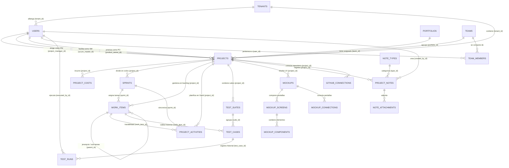

# Esquema de Base de Datos, Diccionario de Datos y Diagrama ER
## Sistema de Gestión de Proyectos de Ingeniería y Auditoría de Calidad (Multi-Tenant)

Este documento describe de forma exhaustiva el esquema relacional de la base de datos (diseñado para PostgreSQL), el diccionario de datos detallado y el modelo Entidad-Relación (ER) que soporta el funcionamiento completo de la plataforma.

---

## 1. Diagrama Entidad-Relación (ER)

### 1.1. Representación en Formato Mermaid
El siguiente diagrama muestra las entidades principales y sus relaciones:



### 1.2. Resumen de Relaciones y Llaves Foráneas (FK)

| Tabla Origen | Columna Origen (FK) | Tabla Destino (PK) | Comportamiento en Eliminación |
| :--- | :--- | :--- | :--- |
| **users** | `tenant_id` | **tenants** (`id`) | `ON DELETE CASCADE` |
| **projects** | `tenant_id` | **tenants** (`id`) | `ON DELETE CASCADE` |
| **projects** | `portfolio_id` | **portfolios** (`id`) | `ON DELETE SET NULL` |
| **projects** | `team_id` | **teams** (`id`) | `ON DELETE SET NULL` |
| **projects** | `project_manager_id` | **users** (`id`) | `ON DELETE SET NULL` |
| **projects** | `scrum_master_id` | **users** (`id`) | `ON DELETE SET NULL` |
| **projects** | `product_owner_id` | **users** (`id`) | `ON DELETE SET NULL` |
| **team_members** | `user_id` | **users** (`id`) | `ON DELETE CASCADE` |
| **team_members** | `team_id` | **teams** (`id`) | `ON DELETE CASCADE` |
| **project_costs** | `project_id` | **projects** (`id`) | `ON DELETE CASCADE` |
| **sprints** | `project_id` | **projects** (`id`) | `ON DELETE CASCADE` |
| **work_items** | `project_id` | **projects** (`id`) | `ON DELETE CASCADE` |
| **work_items** | `sprint_id` | **sprints** (`id`) | `ON DELETE SET NULL` |
| **work_items** | `parent_id` | **work_items** (`id`) | `ON DELETE SET NULL` |
| **work_items** | `assignee_id` | **users** (`id`) | `ON DELETE SET NULL` |
| **work_items** | `reporter_id` | **users** (`id`) | `ON DELETE SET NULL` |
| **project_activities** | `project_id` | **projects** (`id`) | `ON DELETE CASCADE` |
| **project_activities** | `sprint_id` | **sprints** (`id`) | `ON DELETE SET NULL` |
| **project_activities** | `work_item_id` | **work_items** (`id`) | `ON DELETE SET NULL` |
| **project_activities** | `assigned_to_id` | **users** (`id`) | `ON DELETE SET NULL` |
| **project_activities** | `depends_on_id` | **project_activities** (`id`) | `ON DELETE SET NULL` |
| **test_suites** | `project_id` | **projects** (`id`) | `ON DELETE CASCADE` |
| **test_cases** | `suite_id` | **test_suites** (`id`) | `ON DELETE CASCADE` |
| **test_cases** | `work_item_id` | **work_items** (`id`) | `ON DELETE SET NULL` |
| **test_runs** | `test_case_id` | **test_cases** (`id`) | `ON DELETE CASCADE` |
| **test_runs** | `executed_by_id` | **users** (`id`) | `ON DELETE SET NULL` |
| **mockups** | `project_id` | **projects** (`id`) | `ON DELETE CASCADE` |
| **mockup_screens** | `mockup_id` | **mockups** (`id`) | `ON DELETE CASCADE` |
| **mockup_components** | `screen_id` | **mockup_screens** (`id`) | `ON DELETE CASCADE` |
| **mockup_components** | `mockup_id` | **mockups** (`id`) | `ON DELETE CASCADE` |
| **mockup_connections** | `mockup_id` | **mockups** (`id`) | `ON DELETE CASCADE` |
| **github_connections** | `project_id` | **projects** (`id`) | `ON DELETE CASCADE` |
| **project_notes** | `project_id` | **projects** (`id`) | `ON DELETE CASCADE` |
| **project_notes** | `type_id` | **note_types** (`id`) | `ON DELETE SET NULL` |
| **project_notes** | `created_by_id` | **users** (`id`) | `ON DELETE SET NULL` |
| **note_attachments** | `note_id` | **project_notes** (`id`) | `ON DELETE CASCADE` |

---

## 2. Diccionario de Datos Detallado

A continuación se describen cada uno de los atributos de las entidades principales del sistema.

### 2.1. Tabla: `tenants` (Inquilinos de la Organización)
Representa los límites de aislamiento lógico para clientes, marcas o filiales del grupo corporativo.

| Nombre de Columna | Tipo de Datos | Nulidad | Llave | Valor por Defecto | Descripción |
| :--- | :--- | :---: | :---: | :---: | :--- |
| `id` | `VARCHAR(50)` | `NOT NULL` | **PK** | | Identificador único del tenant (ej. 'grupo-campestre'). |
| `name` | `VARCHAR(100)` | `NOT NULL` | | | Nombre comercial o razón social. |
| `description` | `TEXT` | `NULL` | | | Resumen ejecutivo o información institucional. |
| `domain` | `VARCHAR(100)` | `NOT NULL` | | | Dominio de red asociado para inicio de sesión o validaciones. |
| `plan` | `VARCHAR(20)` | `NOT NULL` | | 'Basics' | Tipo de suscripción de la plataforma ('Basics', 'Premium', 'Enterprise'). |
| `status` | `VARCHAR(20)` | `NOT NULL` | | 'Active' | Estado del tenant ('Active', 'Inactive'). |

### 2.2. Tabla: `users` (Usuarios de la Plataforma)
Contiene las cuentas de acceso del personal directivo, administrativo, de ingeniería y calidad.

| Nombre de Columna | Tipo de Datos | Nulidad | Llave | Valor por Defecto | Descripción |
| :--- | :--- | :---: | :---: | :---: | :--- |
| `id` | `VARCHAR(50)` | `NOT NULL` | **PK** | | Identificador de cuenta o alias único de login. |
| `first_name` | `VARCHAR(80)` | `NOT NULL` | | | Nombres de la persona. |
| `last_name` | `VARCHAR(80)` | `NOT NULL` | | | Apellidos de la persona. |
| `email` | `VARCHAR(150)` | `NOT NULL` | **UK** | | Correo electrónico corporativo único de acceso. |
| `avatar_url` | `TEXT` | `NULL` | | | Enlace a la imagen de perfil. |
| `role` | `VARCHAR(50)` | `NOT NULL` | | | Rol asignado (ej. 'Administrador', 'Sponsor / Directora', 'QA Manager'). |
| `status` | `VARCHAR(20)` | `NOT NULL` | | 'ACTIVE' | Estado del usuario ('ACTIVE', 'INACTIVE', 'PENDING'). |
| `password` | `VARCHAR(255)` | `NULL` | | | Hash o cadena encriptada de contraseña para el login local. |
| `tenant_id` | `VARCHAR(50)` | `NOT NULL` | **FK** | 'grupo-campestre' | Referencia al tenant organizativo al que pertenece. |

### 2.3. Tabla: `teams` (Equipos de Trabajo)
Agrupaciones lógicas de recursos técnicos con capacidad asignada para desarrollo de proyectos.

| Nombre de Columna | Tipo de Datos | Nulidad | Llave | Valor por Defecto | Descripción |
| :--- | :--- | :---: | :---: | :---: | :--- |
| `id` | `VARCHAR(50)` | `NOT NULL` | **PK** | | Identificador único del equipo. |
| `name` | `VARCHAR(100)` | `NOT NULL` | | | Nombre del equipo (ej. 'Célula Móvil', 'Desarrollo Core'). |
| `capacity` | `INTEGER` | `NOT NULL` | | | Capacidad total estimada del equipo en horas por semana. |

### 2.4. Tabla: `team_members` (Miembros del Equipo)
Tabla de rompimiento de relación muchos a muchos entre `teams` y `users`, detallando la capacidad y habilidades de cada recurso.

| Nombre de Columna | Tipo de Datos | Nulidad | Llave | Valor por Defecto | Descripción |
| :--- | :--- | :---: | :---: | :---: | :--- |
| `team_id` | `VARCHAR(50)` | `NOT NULL` | **PK, FK** | | Identificador del equipo asociado. |
| `user_id` | `VARCHAR(50)` | `NOT NULL` | **PK, FK** | | Identificador del usuario. |
| `role` | `VARCHAR(80)` | `NOT NULL` | | | Rol específico dentro de la célula de trabajo. |
| `capacity_hours` | `INTEGER` | `NOT NULL` | | | Horas asignadas semanalmente por este miembro al equipo. |
| `skills` | `TEXT[]` | `NULL` | | | Lista o arreglo de habilidades especializadas (ej. React, PostgreSQL). |

### 2.5. Tabla: `projects` (Proyectos)
Entidad central que registra los proyectos tecnológicos, su estado, presupuesto, líderes asignados y prioridades.

| Nombre de Columna | Tipo de Datos | Nulidad | Llave | Valor por Defecto | Descripción |
| :--- | :--- | :---: | :---: | :---: | :--- |
| `id` | `VARCHAR(50)` | `NOT NULL` | **PK** | | Identificador único del proyecto. |
| `portfolio_id` | `VARCHAR(50)` | `NULL` | **FK** | | Vinculación a un portafolio estratégico global. |
| `team_id` | `VARCHAR(50)` | `NULL` | **FK** | | Célula o equipo de desarrollo asignado al proyecto. |
| `name` | `VARCHAR(150)` | `NOT NULL` | | | Nombre descriptivo del proyecto. |
| `code` | `VARCHAR(30)` | `NOT NULL` | **UK** | | Código mnemónico de proyecto para claves Kanban (ej. 'APP-TEL'). |
| `description` | `TEXT` | `NULL` | | | Alcance, objetivos y notas conceptuales de la iniciativa. |
| `client` | `VARCHAR(100)` | `NULL` | | | Cliente final, subsidiaria o área de negocio beneficiaria. |
| `sponsor` | `VARCHAR(50)` | `NULL` | | | Patrocinador o sponsor directivo del proyecto (User ID). |
| `project_manager_id` | `VARCHAR(50)` | `NOT NULL` | **FK** | | Líder técnico o Project Manager encargado del proyecto (User ID). |
| `scrum_master_id` | `VARCHAR(50)` | `NOT NULL` | **FK** | | Scrum Master asignado para la facilitación ágil (User ID). |
| `product_owner_id` | `VARCHAR(50)` | `NOT NULL` | **FK** | | Dueño de Producto o Product Owner responsable del backlog (User ID). |
| `status` | `VARCHAR(25)` | `NOT NULL` | | 'REQUERIMIENTOS' | Estado en el ciclo de vida del proyecto. |
| `priority` | `VARCHAR(10)` | `NOT NULL` | | 'MEDIUM' | Nivel de urgencia o prioridad ('HIGH', 'MEDIUM', 'LOW'). |
| `start_date` | `DATE` | `NULL` | | | Fecha de inicio planificada. |
| `end_date` | `DATE` | `NULL` | | | Fecha de finalización estimada o límite comprometida. |
| `sprint_size_weeks` | `INTEGER` | `NOT NULL` | | 2 | Tamaño de los Sprints de trabajo en semanas. |
| `sprint_size_days` | `INTEGER` | `NOT NULL` | | 10 | Duración del Sprint traducida a días hábiles. |
| `budget_total` | `NUMERIC(14,2)` | `NOT NULL` | | 0.00 | Presupuesto total aprobado para el proyecto. |
| `tenant_id` | `VARCHAR(50)` | `NOT NULL` | **FK** | 'grupo-campestre' | Tenant organizativo propietario del proyecto. |
| `desarrollo` | `VARCHAR(25)` | `NULL` | | 'Interno' | Modalidad de ingeniería ('Interno', 'Mixto', 'Externo', 'Sin desarrollo'). |
| `categoria` | `VARCHAR(25)` | `NULL` | | 'Mediano' | Clasificación por envergadura física ('Pequeño', 'Mediano', 'Grande', 'Muy Grande'). |

### 2.6. Tabla: `project_costs` (Costos y Presupuestos Detallados)
Registra los gastos asociados a un proyecto agrupados por tipo, incluyendo evidencias de archivos digitales guardados en storage.

| Nombre de Columna | Tipo de Datos | Nulidad | Llave | Valor por Defecto | Descripción |
| :--- | :--- | :---: | :---: | :---: | :--- |
| `id` | `VARCHAR(50)` | `NOT NULL` | **PK** | | Identificador de la transacción de costo. |
| `project_id` | `VARCHAR(50)` | `NOT NULL` | **FK** | | Proyecto al cual se le imputa el gasto. |
| `cost_type` | `VARCHAR(25)` | `NOT NULL` | | | Categoría de gasto ('INFRAESTRUCTURA', 'LICENCIAS', 'OUTSOURCING', 'NOMINA', 'OTROS'). |
| `description` | `VARCHAR(255)` | `NOT NULL` | | | Detalle del concepto o factura. |
| `amount` | `NUMERIC(14,2)` | `NOT NULL` | | | Importe monetario exacto del gasto. |
| `currency` | `VARCHAR(5)` | `NOT NULL` | | 'USD' | Moneda utilizada (ej. 'USD', 'EUR'). |
| `created_at` | `TIMESTAMPTZ` | `NOT NULL` | | `NOW()` | Fecha y hora de creación del registro. |
| `document_number`| `VARCHAR(50)` | `NULL` | | | Número físico de factura, boleta o comprobante. |
| `document_date` | `DATE` | `NULL` | | | Fecha de emisión de la factura física. |
| `storage_key` | `TEXT` | `NULL` | | | Clave única de referencia del archivo digitalizado en la nube (GCS). |
| `storage_url` | `TEXT` | `NULL` | | | URL firmada para la descarga directa del adjunto. |
| `file_name` | `VARCHAR(255)` | `NULL` | | | Nombre original del archivo adjunto. |
| `file_size` | `VARCHAR(30)` | `NULL` | | | Tamaño del archivo con formato legible (ej. '1.4 MB'). |
| `uploaded_at` | `TIMESTAMPTZ` | `NULL` | | | Fecha y hora exacta de carga al servidor de storage. |

### 2.7. Tabla: `sprints` (Sprints / Ciclos Ágiles)
Representa los bloques de tiempo iterativos en los que el equipo ejecuta los requerimientos del proyecto.

| Nombre de Columna | Tipo de Datos | Nulidad | Llave | Valor por Defecto | Descripción |
| :--- | :--- | :---: | :---: | :---: | :--- |
| `id` | `VARCHAR(50)` | `NOT NULL` | **PK** | | Identificador único del Sprint. |
| `project_id` | `VARCHAR(50)` | `NOT NULL` | **FK** | | Proyecto al que pertenece el Sprint. |
| `name` | `VARCHAR(80)` | `NOT NULL` | | | Nombre del Sprint (ej. 'Sprint 1 - MVP'). |
| `goal` | `TEXT` | `NULL` | | | Meta u objetivo del Sprint comprometido por el equipo. |
| `start_date` | `DATE` | `NOT NULL` | | | Fecha de inicio del bloque de tiempo. |
| `end_date` | `DATE` | `NOT NULL` | | | Fecha de cierre planificada del Sprint. |
| `status` | `VARCHAR(20)` | `NOT NULL` | | 'NO_INICIADO' | Estado del Sprint ('NO_INICIADO', 'EN_CURSO', 'FINALIZADO'). |
| `velocity` | `INTEGER` | `NOT NULL` | | 0 | Velocidad real lograda (en puntos de historia completados). |
| `capacity` | `INTEGER` | `NOT NULL` | | 0 | Capacidad planificada inicial del Sprint en puntos. |

### 2.8. Tabla: `work_items` (Historias de Usuario, Tareas y Bugs)
Los ítems del Backlog que describen las tareas funcionales y técnicas del ciclo Scrum.

| Nombre de Columna | Tipo de Datos | Nulidad | Llave | Valor por Defecto | Descripción |
| :--- | :--- | :---: | :---: | :---: | :--- |
| `id` | `VARCHAR(50)` | `NOT NULL` | **PK** | | Identificador único del requerimiento. |
| `project_id` | `VARCHAR(50)` | `NOT NULL` | **FK** | | Proyecto asociado. |
| `sprint_id` | `VARCHAR(50)` | `NULL` | **FK** | | Sprint asignado (vacío indica que está en el Product Backlog). |
| `parent_id` | `VARCHAR(50)` | `NULL` | **FK** | | Ítem padre (para modelar jerarquías: Historias de Usuario -> Tareas). |
| `assignee_id` | `VARCHAR(50)` | `NULL` | **FK** | | Recurso técnico encargado del desarrollo (User ID). |
| `reporter_id` | `VARCHAR(50)` | `NULL` | **FK** | | Persona que reportó o redactó el requerimiento (User ID). |
| `key` | `VARCHAR(30)` | `NOT NULL` | | | Clave numerada automática (ej. 'APP-001', 'BUG-005'). |
| `title` | `VARCHAR(150)` | `NOT NULL` | | | Título o nombre corto del requerimiento. |
| `description` | `TEXT` | `NULL` | | | Criterios de aceptación detallados o descripción técnica. |
| `type` | `VARCHAR(25)` | `NOT NULL` | | 'HISTORIA_USUARIO'| Categoría de ítem ('HISTORIA_USUARIO', 'TAREA', 'BUG'). |
| `status` | `VARCHAR(20)` | `NOT NULL` | | 'BACKLOG' | Estado de progreso ('BACKLOG', 'POR_HACER', 'EN_CURSO', 'QA', 'FINALIZADO'). |
| `priority` | `VARCHAR(10)` | `NOT NULL` | | 'MEDIUM' | Prioridad ('HIGH', 'MEDIUM', 'LOW'). |
| `story_points` | `INTEGER` | `NULL` | | | Esfuerzo asignado bajo escala Fibonacci (ej. 1, 2, 3, 5, 8, 13). |
| `created_at` | `TIMESTAMPTZ` | `NOT NULL` | | `NOW()` | Fecha y hora de creación de la tarea. |

### 2.9. Tabla: `project_activities` (Tareas y Actividades del Cronograma Gantt)
Contiene las actividades planificadas secuencialmente en el tiempo, ligadas a sus predecesores y con cálculo de duraciones reales.

| Nombre de Columna | Tipo de Datos | Nulidad | Llave | Valor por Defecto | Descripción |
| :--- | :--- | :---: | :---: | :---: | :--- |
| `id` | `VARCHAR(50)` | `NOT NULL` | **PK** | | Identificador de la actividad Gantt. |
| `project_id` | `VARCHAR(50)` | `NOT NULL` | **FK** | | Proyecto asociado de Gantt. |
| `sprint_id` | `VARCHAR(50)` | `NULL` | **FK** | | Sprint relacionado. |
| `work_item_id` | `VARCHAR(50)` | `NULL` | **FK** | | Trazabilidad con una Historia de Usuario (HU) del Backlog. |
| `name` | `VARCHAR(120)` | `NOT NULL` | | | Nombre de la actividad. |
| `description` | `TEXT` | `NULL` | | | Detalle o entregables de la actividad. |
| `assigned_to_id`| `VARCHAR(50)` | `NULL` | **FK** | | Responsable técnico asignado (User ID). |
| `start_date` | `DATE` | `NOT NULL` | | | Fecha de inicio programada. |
| `end_date` | `DATE` | `NOT NULL` | | | Fecha de fin planificada. |
| `duration_days` | `INTEGER` | `NOT NULL` | | | Duración de la actividad expresada en días hábiles. |
| `progress` | `INTEGER` | `NOT NULL` | | 0 | Porcentaje de avance real (0-100%). |
| `status` | `VARCHAR(20)` | `NOT NULL` | | 'PENDIENTE' | Estado de la actividad ('PENDIENTE', 'EN_CURSO', 'COMPLETADA'). |
| `depends_on_id` | `VARCHAR(50)` | `NULL` | **FK** | | Identificador de la actividad predecesora (dependencia). |

### 2.10. Tabla: `test_suites` (Conjuntos de Pruebas de Calidad QA)
Agrupaciones lógicas de casos de prueba enfocados en validar componentes específicos de los productos.

| Nombre de Columna | Tipo de Datos | Nulidad | Llave | Valor por Defecto | Descripción |
| :--- | :--- | :---: | :---: | :---: | :--- |
| `id` | `VARCHAR(50)` | `NOT NULL` | **PK** | | Identificador único del suite. |
| `project_id` | `VARCHAR(50)` | `NOT NULL` | **FK** | | Proyecto de ingeniería validado. |
| `name` | `VARCHAR(120)` | `NOT NULL` | | | Título del suite (ej. 'Pruebas de Seguridad', 'Regresión Core'). |

### 2.11. Tabla: `test_cases` (Casos de Prueba)
Casos estructurados con pasos secuenciales, precondiciones y resultados esperados alineados a historias de usuario.

| Nombre de Columna | Tipo de Datos | Nulidad | Llave | Valor por Defecto | Descripción |
| :--- | :--- | :---: | :---: | :---: | :--- |
| `id` | `VARCHAR(50)` | `NOT NULL` | **PK** | | Identificador del caso de prueba. |
| `suite_id` | `VARCHAR(50)` | `NOT NULL` | **FK** | | Suite contenedor. |
| `work_item_id` | `VARCHAR(50)` | `NULL` | **FK** | | Historia de usuario asociada (Trazabilidad QA-Backlog). |
| `title` | `VARCHAR(150)` | `NOT NULL` | | | Enunciado del caso de prueba. |
| `steps` | `TEXT[]` | `NOT NULL` | | | Listado estructurado de pasos a reproducir (ej. Arreglo texto). |
| `expected` | `TEXT` | `NOT NULL` | | | Comportamiento o resultado final esperado. |
| `status` | `VARCHAR(20)` | `NOT NULL` | | 'PENDING' | Estado de calidad ('PENDING', 'PASSED', 'FAILED'). |

### 2.12. Tabla: `test_runs` (Historial de Ejecución de Pruebas)
Bitácora de ejecuciones de control de calidad con carga de evidencias y firmas digitales de auditores.

| Nombre de Columna | Tipo de Datos | Nulidad | Llave | Valor por Defecto | Descripción |
| :--- | :--- | :---: | :---: | :---: | :--- |
| `id` | `VARCHAR(50)` | `NOT NULL` | **PK** | | Identificador de la ejecución. |
| `test_case_id` | `VARCHAR(50)` | `NOT NULL` | **FK** | | Caso de prueba ejecutado. |
| `executed_by_id`| `VARCHAR(50)` | `NOT NULL` | **FK** | | Auditor o analista de calidad que ejecutó la prueba. |
| `status` | `VARCHAR(20)` | `NOT NULL` | | 'PENDING' | Veredicto final ('PASSED', 'FAILED', 'PENDING'). |
| `evidence` | `TEXT` | `NULL` | | | Texto descriptivo del resultado real o log de error técnico. |
| `notes` | `TEXT` | `NULL` | | | Observaciones adicionales de la ronda de pruebas. |
| `executed_at` | `TIMESTAMPTZ` | `NOT NULL` | | `NOW()` | Fecha y hora exacta de la ejecución. |

### 2.13. Tabla: `project_notes` (Bitácoras y Notas de Gestión de Proyectos)
Canal oficial para asentar incidentes, compromisos, minutas de reuniones y deudas técnicas ligadas a tipos parametrizables.

| Nombre de Columna | Tipo de Datos | Nulidad | Llave | Valor por Defecto | Descripción |
| :--- | :--- | :---: | :---: | :---: | :--- |
| `id` | `VARCHAR(50)` | `NOT NULL` | **PK** | | Identificador único de la nota. |
| `project_id` | `VARCHAR(50)` | `NOT NULL` | **FK** | | Proyecto donde se asienta la bitácora. |
| `type_id` | `VARCHAR(50)` | `NOT NULL` | **FK** | | Categoría de la nota (referencia a `note_types`). |
| `title` | `VARCHAR(150)` | `NOT NULL` | | | Título descriptivo del hecho registrado. |
| `content` | `TEXT` | `NOT NULL` | | | Contenido o cuerpo redactado de la bitácora. |
| `created_at` | `TIMESTAMPTZ` | `NOT NULL` | | `NOW()` | Fecha de creación del registro. |
| `updated_at` | `TIMESTAMPTZ` | `NOT NULL` | | `NOW()` | Fecha de la última modificación. |
| `created_by_id` | `VARCHAR(50)` | `NULL` | **FK** | | Colaborador autor de la nota (User ID). |
| `active` | `BOOLEAN` | `NOT NULL` | | `TRUE` | Bandera lógica de activación (para archivar notas históricas). |

---

## 3. Sentencias DDL PostgreSQL (Esquema SQL de Producción)

A continuación se detallan las instrucciones SQL completas para desplegar este diseño relacional robusto sobre una instancia PostgreSQL. El script incluye restricciones `FOREIGN KEY` con sus correspondientes políticas `ON DELETE`, checks de coherencia para campos monetarios e índices de rendimiento.

```sql
-- =====================================================================
-- SCRIPT DE BASE DE DATOS COMPLETO - PLATAFORMA GESTIÓN DE PROYECTOS
-- MOTOR DE BASE DE DATOS: PostgreSQL (Versión 13 o superior)
-- =====================================================================

BEGIN;

-- 1. Estructura Multi-Tenant Base
CREATE TABLE tenants (
  id VARCHAR(50) PRIMARY KEY,
  name VARCHAR(100) NOT NULL,
  description TEXT,
  domain VARCHAR(100) NOT NULL,
  plan VARCHAR(20) NOT NULL DEFAULT 'Basics' CHECK (plan IN ('Basics', 'Premium', 'Enterprise')),
  status VARCHAR(20) NOT NULL DEFAULT 'Active' CHECK (status IN ('Active', 'Inactive'))
);

-- 2. Directorio de Cuentas y Colaboradores
CREATE TABLE users (
  id VARCHAR(50) PRIMARY KEY,
  first_name VARCHAR(80) NOT NULL,
  last_name VARCHAR(80) NOT NULL,
  email VARCHAR(150) NOT NULL UNIQUE,
  avatar_url TEXT,
  role VARCHAR(50) NOT NULL,
  status VARCHAR(20) NOT NULL DEFAULT 'ACTIVE' CHECK (status IN ('ACTIVE', 'INACTIVE', 'PENDING')),
  password VARCHAR(255),
  tenant_id VARCHAR(50) NOT NULL DEFAULT 'grupo-campestre' REFERENCES tenants(id) ON DELETE CASCADE
);

-- 3. Portafolios de Inversión
CREATE TABLE portfolios (
  id VARCHAR(50) PRIMARY KEY,
  name VARCHAR(100) NOT NULL,
  description TEXT,
  status VARCHAR(20) NOT NULL DEFAULT 'ACTIVE' CHECK (status IN ('ACTIVE', 'ARCHIVED')),
  priority VARCHAR(10) NOT NULL DEFAULT 'MEDIUM' CHECK (priority IN ('HIGH', 'MEDIUM', 'LOW'))
);

-- 4. Equipos y Asignación de Recursos
CREATE TABLE teams (
  id VARCHAR(50) PRIMARY KEY,
  name VARCHAR(100) NOT NULL,
  capacity INTEGER NOT NULL CHECK (capacity > 0)
);

CREATE TABLE team_members (
  team_id VARCHAR(50) NOT NULL REFERENCES teams(id) ON DELETE CASCADE,
  user_id VARCHAR(50) NOT NULL REFERENCES users(id) ON DELETE CASCADE,
  role VARCHAR(80) NOT NULL,
  capacity_hours INTEGER NOT NULL CHECK (capacity_hours >= 0),
  skills TEXT[],
  PRIMARY KEY (team_id, user_id)
);

-- 5. Proyectos Tecnológicos
CREATE TABLE projects (
  id VARCHAR(50) PRIMARY KEY,
  portfolio_id VARCHAR(50) REFERENCES portfolios(id) ON DELETE SET NULL,
  team_id VARCHAR(50) REFERENCES teams(id) ON DELETE SET NULL,
  name VARCHAR(150) NOT NULL,
  code VARCHAR(30) NOT NULL UNIQUE,
  description TEXT,
  client VARCHAR(100),
  sponsor VARCHAR(50),
  project_manager_id VARCHAR(50) REFERENCES users(id) ON DELETE SET NULL,
  scrum_master_id VARCHAR(50) REFERENCES users(id) ON DELETE SET NULL,
  product_owner_id VARCHAR(50) REFERENCES users(id) ON DELETE SET NULL,
  status VARCHAR(25) NOT NULL DEFAULT 'REQUERIMIENTOS' CHECK (status IN ('REQUERIMIENTOS', 'APROBADO', 'DESARROLLO', 'PRUEBAS', 'FINALIZADO', 'CANCELADO')),
  priority VARCHAR(10) NOT NULL DEFAULT 'MEDIUM' CHECK (priority IN ('HIGH', 'MEDIUM', 'LOW')),
  start_date DATE,
  end_date DATE,
  sprint_size_weeks INTEGER NOT NULL DEFAULT 2 CHECK (sprint_size_weeks > 0),
  sprint_size_days INTEGER NOT NULL DEFAULT 10 CHECK (sprint_size_days > 0),
  budget_total NUMERIC(14,2) NOT NULL DEFAULT 0.00 CHECK (budget_total >= 0.00),
  tenant_id VARCHAR(50) NOT NULL DEFAULT 'grupo-campestre' REFERENCES tenants(id) ON DELETE CASCADE,
  desarrollo VARCHAR(25) DEFAULT 'Interno' CHECK (desarrollo IN ('Interno', 'Mixto', 'Externo', 'Sin desarrollo')),
  categoria VARCHAR(25) DEFAULT 'Mediano' CHECK (categoria IN ('Pequeño', 'Mediano', 'Grande', 'Muy Grande')),
  CONSTRAINT chk_dates CHECK (end_date >= start_date)
);

-- 6. Costos y Presupuestos con Archivos de Evidencias Digitales
CREATE TABLE project_costs (
  id VARCHAR(50) PRIMARY KEY,
  project_id VARCHAR(50) NOT NULL REFERENCES projects(id) ON DELETE CASCADE,
  cost_type VARCHAR(25) NOT NULL CHECK (cost_type IN ('INFRAESTRUCTURA', 'LICENCIAS', 'OUTSOURCING', 'NOMINA', 'OTROS')),
  description VARCHAR(255) NOT NULL,
  amount NUMERIC(14,2) NOT NULL CHECK (amount >= 0.00),
  currency VARCHAR(5) NOT NULL DEFAULT 'USD',
  created_at TIMESTAMPTZ NOT NULL DEFAULT NOW(),
  document_number VARCHAR(50),
  document_date DATE,
  storage_key TEXT,
  storage_url TEXT,
  file_name VARCHAR(255),
  file_size VARCHAR(30),
  uploaded_at TIMESTAMPTZ
);

-- 7. Ciclos Scrum / Sprints
CREATE TABLE sprints (
  id VARCHAR(50) PRIMARY KEY,
  project_id VARCHAR(50) NOT NULL REFERENCES projects(id) ON DELETE CASCADE,
  name VARCHAR(80) NOT NULL,
  goal TEXT,
  start_date DATE NOT NULL,
  end_date DATE NOT NULL,
  status VARCHAR(20) NOT NULL DEFAULT 'NO_INICIADO' CHECK (status IN ('NO_INICIADO', 'EN_CURSO', 'FINALIZADO')),
  velocity INTEGER NOT NULL DEFAULT 0 CHECK (velocity >= 0),
  capacity INTEGER NOT NULL DEFAULT 0 CHECK (capacity >= 0),
  CONSTRAINT chk_sprint_dates CHECK (end_date >= start_date)
);

-- 8. Elementos de Trabajo (Backlog)
CREATE TABLE work_items (
  id VARCHAR(50) PRIMARY KEY,
  project_id VARCHAR(50) NOT NULL REFERENCES projects(id) ON DELETE CASCADE,
  sprint_id VARCHAR(50) REFERENCES sprints(id) ON DELETE SET NULL,
  parent_id VARCHAR(50) REFERENCES work_items(id) ON DELETE SET NULL,
  assignee_id VARCHAR(50) REFERENCES users(id) ON DELETE SET NULL,
  reporter_id VARCHAR(50) REFERENCES users(id) ON DELETE SET NULL,
  key VARCHAR(30) NOT NULL,
  title VARCHAR(150) NOT NULL,
  description TEXT,
  type VARCHAR(25) NOT NULL DEFAULT 'HISTORIA_USUARIO' CHECK (type IN ('HISTORIA_USUARIO', 'TAREA', 'BUG')),
  status VARCHAR(20) NOT NULL DEFAULT 'BACKLOG' CHECK (status IN ('BACKLOG', 'POR_HACER', 'EN_CURSO', 'QA', 'FINALIZADO')),
  priority VARCHAR(10) NOT NULL DEFAULT 'MEDIUM' CHECK (priority IN ('HIGH', 'MEDIUM', 'LOW')),
  story_points INTEGER CHECK (story_points IN (1, 2, 3, 5, 8, 13, 21, 34)),
  created_at TIMESTAMPTZ NOT NULL DEFAULT NOW()
);

-- 9. Actividades Cronograma Gantt y Dependencias Cascada
CREATE TABLE project_activities (
  id VARCHAR(50) PRIMARY KEY,
  project_id VARCHAR(50) NOT NULL REFERENCES projects(id) ON DELETE CASCADE,
  sprint_id VARCHAR(50) REFERENCES sprints(id) ON DELETE SET NULL,
  work_item_id VARCHAR(50) REFERENCES work_items(id) ON DELETE SET NULL,
  name VARCHAR(120) NOT NULL,
  description TEXT,
  assigned_to_id VARCHAR(50) REFERENCES users(id) ON DELETE SET NULL,
  start_date DATE NOT NULL,
  end_date DATE NOT NULL,
  duration_days INTEGER NOT NULL CHECK (duration_days >= 1),
  progress INTEGER NOT NULL DEFAULT 0 CHECK (progress BETWEEN 0 AND 100),
  status VARCHAR(20) NOT NULL DEFAULT 'PENDIENTE' CHECK (status IN ('PENDIENTE', 'EN_CURSO', 'COMPLETADA')),
  depends_on_id VARCHAR(50) REFERENCES project_activities(id) ON DELETE SET NULL,
  CONSTRAINT chk_activity_dates CHECK (end_date >= start_date)
);

-- 10. Control de Calidad: Conjunto de Pruebas, Casos y Bitácoras QA
CREATE TABLE test_suites (
  id VARCHAR(50) PRIMARY KEY,
  project_id VARCHAR(50) NOT NULL REFERENCES projects(id) ON DELETE CASCADE,
  name VARCHAR(120) NOT NULL
);

CREATE TABLE test_cases (
  id VARCHAR(50) PRIMARY KEY,
  suite_id VARCHAR(50) NOT NULL REFERENCES test_suites(id) ON DELETE CASCADE,
  work_item_id VARCHAR(50) REFERENCES work_items(id) ON DELETE SET NULL,
  title VARCHAR(150) NOT NULL,
  steps TEXT[] NOT NULL,
  expected TEXT NOT NULL,
  status VARCHAR(20) NOT NULL DEFAULT 'PENDING' CHECK (status IN ('PENDING', 'PASSED', 'FAILED'))
);

CREATE TABLE test_runs (
  id VARCHAR(50) PRIMARY KEY,
  test_case_id VARCHAR(50) NOT NULL REFERENCES test_cases(id) ON DELETE CASCADE,
  executed_by_id VARCHAR(50) NOT NULL REFERENCES users(id) ON DELETE SET NULL,
  status VARCHAR(20) NOT NULL DEFAULT 'PENDING' CHECK (status IN ('PASSED', 'FAILED', 'PENDING')),
  evidence TEXT,
  notes TEXT,
  executed_at TIMESTAMPTZ NOT NULL DEFAULT NOW()
);

-- 11. Bitácora de Gestión Integrada (Notas y Minutas)
CREATE TABLE note_types (
  id VARCHAR(50) PRIMARY KEY,
  name VARCHAR(80) NOT NULL UNIQUE,
  description TEXT,
  color VARCHAR(30) NOT NULL DEFAULT 'blue' CHECK (color IN ('blue', 'amber', 'rose', 'emerald', 'indigo', 'purple', 'slate')),
  active BOOLEAN NOT NULL DEFAULT TRUE
);

CREATE TABLE project_notes (
  id VARCHAR(50) PRIMARY KEY,
  project_id VARCHAR(50) NOT NULL REFERENCES projects(id) ON DELETE CASCADE,
  type_id VARCHAR(50) NOT NULL REFERENCES note_types(id) ON DELETE RESTRICT,
  title VARCHAR(150) NOT NULL,
  content TEXT NOT NULL,
  created_at TIMESTAMPTZ NOT NULL DEFAULT NOW(),
  updated_at TIMESTAMPTZ NOT NULL DEFAULT NOW(),
  created_by_id VARCHAR(50) REFERENCES users(id) ON DELETE SET NULL,
  active BOOLEAN NOT NULL DEFAULT TRUE
);

CREATE TABLE note_attachments (
  id VARCHAR(50) PRIMARY KEY,
  note_id VARCHAR(50) NOT NULL REFERENCES project_notes(id) ON DELETE CASCADE,
  name VARCHAR(255) NOT NULL,
  type VARCHAR(20) NOT NULL CHECK (type IN ('file', 'link')),
  url TEXT NOT NULL,
  uploaded_at TIMESTAMPTZ NOT NULL DEFAULT NOW()
);

-- 12. Integración DevOps GitHub y Repositorio de Cambios
CREATE TABLE github_connections (
  id VARCHAR(50) PRIMARY KEY,
  project_id VARCHAR(50) NOT NULL UNIQUE REFERENCES projects(id) ON DELETE CASCADE,
  repository VARCHAR(150) NOT NULL,
  branch VARCHAR(50) NOT NULL DEFAULT 'main',
  webhook_active BOOLEAN NOT NULL DEFAULT TRUE
);

-- =====================================================================
-- SECCIÓN DE ÍNDICES DE RENDIMIENTO (COBERTURA EXCELENTE EN FILTROS)
-- =====================================================================

-- Índices compuestos para consultas optimizadas de proyectos por tenant y líder
CREATE INDEX idx_projects_tenant_status ON projects (tenant_id, status);
CREATE INDEX idx_projects_manager ON projects (project_manager_id);

-- Índices de consulta frecuente para historias de usuario en tableros Kanban
CREATE INDEX idx_work_items_project_sprint ON work_items (project_id, sprint_id, status);
CREATE INDEX idx_work_items_assignee ON work_items (assignee_id, status);

-- Índices para búsqueda cronológica rápida de notas de proyecto
CREATE INDEX idx_project_notes_lookup ON project_notes (project_id, active, created_at DESC);

-- Índices de auditoría de pruebas QA
CREATE INDEX idx_test_runs_case_executed ON test_runs (test_case_id, executed_at DESC);

COMMIT;
```

---

## 4. Normalización y Coherencia de Diseño

El esquema expuesto garantiza las siguientes propiedades relacionales:
1. **Primera Forma Normal (1FN):** Todos los atributos son atómicos; no existen campos multievaluados. Los pasos de casos de prueba (`steps`) y habilidades de miembros (`skills`) utilizan la estructura tipo array de PostgreSQL, garantizando búsquedas e indexación óptima.
2. **Segunda Forma Normal (2FN):** Todas las tablas poseen una clave primaria explícita (`id` o compuesta) y ningún campo depende parcialmente de una sub-clave.
3. **Tercera Forma Normal (3FN):** No existen dependencias transitivas entre columnas no claves. Por ejemplo, los detalles del `User` no están duplicados en la tabla de asignaciones `team_members` ni en `test_runs`, resolviéndose siempre mediante uniones (`JOIN`) con la tabla de maestros correspondientes.
4. **Resiliencia Multi-Tenant:** La inclusión del `tenant_id` permite aplicar aislamiento lógico a nivel de queries mediante directivas de seguridad basadas en el perfil de sesión verificado por tokens JWT.
